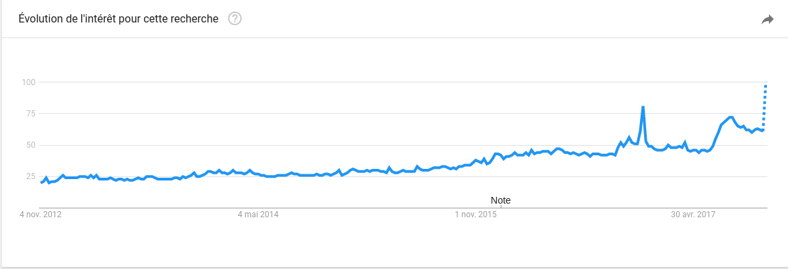

# Is adopting a healthier lifestyle a long-term social change?

# Abstract
> *"A healthy lifestyle, excluding any damaging influences, defines the positive and voluntary measures a person can implement to maintain good mental and physical health. This includes healthy habits in terms of diet, treatment of the body, sex, and the environment"*, http://health.ccm.net 

The idea of the project is to assess whether the population of western countries is adopting a healthier lifestyle. This project aims to determine if this adoption is a trend or a long-term social change. In either cases, we will try to predict the evolution of this behavior over the upcoming years.

In order to achieve that goal, we will use the Amazon reviews dataset. From those reviews, we can extract information about consumer satisfaction, dates, product categories and the enthousiasm for certain products.

With the emergence of new institutions promoting healthy lifes (like vegan shops or fitness centers), finding insights and patterns in people's behavior could be useful to define in which direction this social change is heading.

# Research questions
* Study the evolution of the enthousiasm for healthy products over time.
* Study the correlation between Amazon reviews and trends (using Google Trends).
* Study the price evolution of healthy products.
* Determine the "hype" factor of healthy product categories.
* Forecast the "hype" factor over the upcoming years by categories in order to predict new trends or define decaying ones.
* Correlate the price and the "hype" factor.

# Dataset
* Amazon reviews (Sports and Outdoors, Health and Personal Care, Grocery and Gourmet Food)
* Google Trends API

Here is an example of how the "vegan" keyword is an actual trend and the predictions for that keyword in the future (by Google analytics) from 2012 to 2017:

##### Amazon reviews
First of all, we will create a MongoDB (NoSQL) database in order to store all the useful information. This database is needed to be able to query efficiently the data without having to do it manually (using pandas dataframes). Initially, the database will contain 2 collections of documents, Reviews, Products. The data being in non-strict JSON format, we will have to parse it into strict JSON before inserting it into database.

Then, we will process the data to filter out all non-healthy related reviews and products (because of the huge size of the dataset).

Finally, we will then be able to enrich the data by doing sentiment analysis on reviews (using Deep Learning) in order to determine if a product or a category of products is becoming more or less popular by assigning labels(positive, neutral, negative).

# A list of internal milestones up until project milestone 2
|Week|Expected task|
|---|---|
|Week 1| Setup the server with a MongoDB instance and a NodeJS server, retrieve the data, filter it and insert it into the database
|Week 2| Come up with a clever way of defining the "hype" factor and the sentiment analysis labeling (by either using a platform like Google Machine learning API or by creating our own neural network model).
|Week 3 - 4| Answer the research questions defined before. Assigning the "hype" factor to cateories of products and forecasting it over the upcoming years.

# Questions for TAs
* Should we use an additional dataset in order to determine what products should be classified as "healthy" ?
* Is the sentiment analysis a good idea or is using ratings enough to determine if a product is successful ?
* If yes, which labels should we use ? Is "positive, neutral, negative" enough ?
* Any advice about how we could enrich our dataset with information than just the sentiment analysis label ?
* What time range would be suitable ? +- 5 years ? 10 years ?
